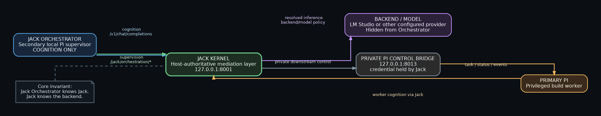
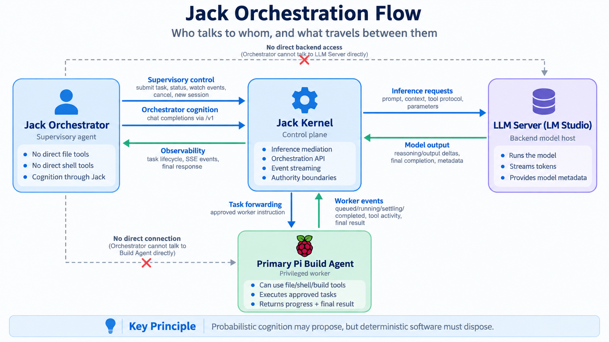

# Jack Kernel

**v0.1.1**

**Probabilistic cognition may propose, but deterministic software must dispose.**

> **START HERE — Plain-English Master Guide:** [`00_Jack_Kernel_Plain_English_Master_Guide_v0.1.1.docx`](00_Jack_Kernel_Plain_English_Master_Guide_v0.1.1.docx)
>
> This is the first document to read. It explains the kernel, the shipped cognition programs, long-horizon state, Pi integration, and the now-accepted **Orchestration Gateway v2** supervisory architecture in plain English. A canonical copy also lives under `Documentation/`.

**Current release reality:** Jack Kernel remains **v0.1.1**. The substantial orchestration upgrade is **Orchestration Gateway v2**, now live-accepted across run-bound identity, replay, cancellation/settlement, concurrent supervisor/worker inference through Jack, and deterministic Primary-Pi-unavailable failure behavior. The accepted Pi control bridge SHA-256 is `D066FA2F9B8A3735A60F57F028087F314F484B28DBD10640FB3D64A4FA29C664`.

## Orchestration at a glance

The diagrams below show the accepted supervisory architecture and the direction of cognition, supervision, worker events, and backend inference. The Jack Orchestrator is cognition-capable but execution-restricted; privileged host consequences remain with Primary Pi, and the supervisor-to-worker path crosses Jack Kernel.





For installation and first-run steps, see [`GETTING_STARTED.md`](GETTING_STARTED.md). For the exact orchestration protocol, see [`ORCHESTRATION_GATEWAY_V2_TECHNICAL_SPEC.md`](ORCHESTRATION_GATEWAY_V2_TECHNICAL_SPEC.md). For the live acceptance record, see [`ORCHESTRATION_GATEWAY_V2_ACCEPTANCE_REPORT.md`](ORCHESTRATION_GATEWAY_V2_ACCEPTANCE_REPORT.md).

Jack Kernel is a local-first host-authoritative inference mediation/control layer between an agent/client and an OpenAI-compatible model backend. Jack is **not the agent and not the LLM**. The agent chooses the task and application workflow. The model supplies probabilistic cognition. Jack controls the host-governed inference environment and authority boundaries around model cognition: stage topology, reasoning and sampling, tool exposure, context projection, answer/commit authority, retention, evidence handling, and host-side execution boundaries.

Deep Research, Agentic, and Code Debugging are **reference programs that demonstrate what can be expressed on the kernel**. They are not the product boundary. Jack can be used to build other staged reasoning, memory, evidence, validation, safety, approval, routing, training-data, and long-horizon workflow layers.

## A Note from the Creator — JML

Jack Kernel is much more than the custom modes shipped with it. Deep Research, Agentic, and Code Debugging are examples of what becomes possible when a deterministic kernel sits between the agent and the LLM. The larger opportunity is to build your own inference layers: dynamic and adaptive reasoning and parameter control, orchestrated agentic workflows, custom staged reasoning, custom context and memory management, model routing, evidence and verification layers, approval gates, and other host-authoritative programs. Treat the bundled modes as starting points, not limits. Experiment, specialize them, replace them, and build new layers that fit your own models and workloads.

## Supervisory orchestration — Orchestration Gateway v2

Jack's host-authoritative boundary now extends beyond agent-to-model inference to a **supervisor-to-worker control path**. The accepted topology is:

```text
Jack Orchestrator (secondary cognition-only Pi)
        │
        ├── cognition ───────────────> Jack Kernel :8001/v1 ──> backend/model
        │
        └── supervision ─────────────> Jack Kernel :8001/jack/orchestration
                                           │
                                           ▼
                                  private Pi bridge :8013
                                           │
                                           ▼
                                  privileged Primary Pi
```

The Jack Orchestrator is not a privileged build agent. Its model-facing capability surface is intentionally limited to exactly five supervisory tools: `worker_status`, `watch_worker`, `submit_worker_task`, `cancel_worker_task`, and `new_worker_session`. It has no direct filesystem, shell, or process tools; no direct backend endpoint; no direct access to the private Pi bridge on `:8013`; and no Pi `controlToken`. Its consequential influence over the worker crosses Jack's supervisory boundary.

Gateway v2 adds the transport semantics required to make that boundary observable and testable:

- **Run-bound identity:** each controlled task receives a task UUID and a separate run UUID. Message/tool events are attributed only when Pi's control path has positive evidence that they belong to an open run epoch. Untagged events remain untagged; Jack does not infer ownership from timing.
- **Run epochs:** retries/continuations keep one stable `run_id` while incrementing `run_epoch`. `agent_end` closes the low-level epoch; `agent_settled` closes the complete control run.
- **Replayable SSE:** Jack adds process-local monotonic sequence numbers, preserves Pi source events, retains a bounded 512-event replay window by default, supports `Last-Event-ID` / `?after=<seq>`, and returns HTTP `409` with `orchestration_replay_gap` when a requested position has fallen outside the retained window.
- **Cancellation semantics:** logical cancellation can become terminal while the physical run is still open. Jack prevents a new controlled task from overlapping that unsettled run. The terminal settlement snapshot now clears control-run authority before emission, so `settledAt` is paired with `runOpen:false`.
- **Concurrent cognition:** with Jack's saved launcher setting `Maximum concurrent Kernel requests = 2`, live testing proved simultaneous backend inference for Jack Orchestrator and Primary Pi through the same Jack Kernel. This was physical LM Studio slot overlap, not merely application-level status overlap.
- **Deterministic worker-unavailable failure:** with Primary Pi stopped while Jack remained alive, orchestration status, task submission, cancellation, and new-session operations all returned HTTP `502` with `{"detail":"Pi control bridge is unavailable"}`. No worker task was fabricated and no fallback path bypassed Jack.

This Gateway governs the **supervisor-to-worker control path**. It does not claim that Jack presently intercepts every filesystem/shell/process consequence inside the privileged Primary Pi. That stronger chassis/tool-dispatch enforcement remains a separate boundary.

### Accepted orchestration surface

```text
GET  /jack/orchestration/status
GET  /jack/orchestration/events
POST /jack/orchestration/tasks
POST /jack/orchestration/tasks/cancel
POST /jack/orchestration/session/new
```

The gateway is client-agnostic. Jack Orchestrator is the reference cognition-only supervisor architecture; other supervisors can use the same public Jack orchestration API provided they preserve the same authority boundary.

## Run on Windows

1. Install Python 3.
2. From this folder, install the runtime dependencies once:

   `py -3 -m pip install -r requirements.txt`

3. Start Jack with:

   `start.bat`

The launcher opens Jack's configuration interface and starts the local OpenAI-compatible server when requested.

## Backends

LM Studio is the default backend at `http://127.0.0.1:1234/v1`. Jack also supports Ollama, Jan.ai, raw llama.cpp `llama-server`, and custom OpenAI-compatible endpoints.

Jack's default **agent-facing** listener is `http://127.0.0.1:8001/v1`. Port 8001 is intentionally used so Jack does not collide with a stock vLLM OpenAI-compatible server on port 8000. The Custom OpenAI-compatible backend preset remains `http://127.0.0.1:8000/v1`, allowing the common topology `agent -> Jack :8001 -> vLLM :8000` with no manual port changes.

Jack keeps the caller-facing virtual model separate from the actually configured backend model. Reasoning and sampling controls are rebuilt from the active Jack profile rather than delegated to caller overrides.

## Reasoning modes

### Off / Medium / X-High

Direct native backend reasoning modes. They do not run a Jack cognitive stage graph or generate Jack XML and are useful as matched-model baselines.

### Deep Research

Deep Research is Jack's three-stage Preserve-Thinking reference program for deeply studying difficult and complicated tasks. It deliberately extends one task across Thesis, Antithesis, and Synthesis so the same model can develop a rigorous first-principles plan, challenge that work adversarially, and then authoritatively synthesize and execute the final response with access to the full active reasoning trajectory. Its purpose is to increase the depth, scrutiny, and rigor with which a complicated task is examined before commitment. It does not claim that staging increases the model's latent intelligence; it changes the cognitive process and inference topology around the task. Deep Research may improve reasoning utilization, error detection, adversarial scrutiny, and finalization fidelity, and it can be used with models of any size or capability.

- **Stage 1 — Thesis:** X-High @ **0.85**, Preserve Thinking ON, tools physically absent. Thesis reasons from First Principles and produces a concentrated plan for Synthesis. Thesis is explicitly told that Synthesis may receive caller tools and is the execution stage, so it plans required tool use, file/artifact changes, verification, and other execution with Synthesis's later capability in mind. It plans tool use by required capability rather than inventing tool names or schemas it has not been shown, and it does not execute or claim execution.
- **Stage 2 — Antithesis:** Medium @ **0.70**, Preserve Thinking ON, tools OFF. It is explicitly told that Thesis is a plan-only stage with no tools while Synthesis may receive caller tools and execute the plan. It therefore does not fault Thesis merely for not executing work reserved for Synthesis; instead it asks the strongest material adversarial questions, including challenges to incorrect premises, assumptions, weaknesses, omissions, or failure points, and stops. It is questions-only, has no fixed quota or lens taxonomy, and has no answer authority.
- **Stage 3 — Synthesis:** X-High @ **0.70**, Preserve Thinking ON, caller tools available when supplied. Synthesis treats Thesis and Antithesis as untrusted cognitive inputs, decides independently, and is the sole authoritative reasoning, execution, and final-answer stage. When execution is required and an appropriate tool exists, Synthesis performs the work rather than merely describing it.

Only actual host-returned tool results establish tool execution. Jack persists the causal Thesis→Antithesis and Antithesis→Synthesis boundaries through Synthesis so stage identity and the exact active request remain structurally clear. Deep Research preserves the full active cognitive trajectory through the authoritative final. On later re-entry, Jack retires only Stage-1 and Stage-2 native reasoning while retaining the exact user content, Thesis/Antithesis visible outputs, Synthesis tool calls/results and reasoning trajectory, and final answer for downstream continuity.

Deep Research uses host-side `max_tokens` runaway-loop failsafes of **100000 / 20000 / 100000** for Thesis / Antithesis / Synthesis. They are ceilings, not target lengths, and are not projected into model context. Deep Research generates no Jack XML and does not depend on a cognitive-output parser, semantic scorer, retry loop, or post-EOS artifact resolver.

When the caller requests streaming, Deep Research is live at every generation boundary: native reasoning streams on `reasoning_content`; Thesis and Antithesis generated outputs stream token-by-token on the non-authoritative reasoning surface; and the authoritative Synthesis answer streams token-by-token as normal `content`. Jack reconstructs the exact completed stage messages internally without buffering the visible Synthesis answer until EOS.

### Agentic

Agentic is Jack's **Qwen-oriented Preserve-Thinking semantic-consolidation program** for capable multi-turn models. Preserve Thinking support is necessary, but it is not sufficient: the model must also be semantically capable enough to distinguish evidence from claims, deterministic verification from reasoning, prospective challenge from discovered error, and legitimate uncertainty from manufactured caveats.

- **Stage 1 — Full native cognition:** X-High @ **0.70**, Preserve Thinking ON, caller tools available when supplied, and **no Jack cognitive system prompt**. The model receives its full native reasoning opportunity, performs the substantive task naturally, generates the complete Stage-1 answer **A1**, and Jack freezes that exact A1.
- **Stage 2 — Semantic consolidation:** X-High @ **0.50**, Preserve Thinking ON, tools OFF, zero answer authority. Stage 2 sees the exact current user message, the complete immediately preceding Stage-1 native reasoning and tool trajectory, actual Stage-1 tool results, and frozen A1 while that cognitive episode is still locally coherent. It converts the high-bandwidth native cognition into compact, strongly semantic Jack XML.

The Jack XML checkpoint has four semantic responsibilities:

- **grounding** — what was actually observed and not observed;
- **verification** — only deterministic proof actually established by Stage-1 tool evidence, with narrow scope;
- **challenge** — prospective PREMISE / INVALIDATION / HIDDEN ASSUMPTION pressure describing what may make A1 wrong;
- **audit** — concrete output mistakes Stage 2 actually determined are present in frozen A1.

Stage 2 cannot rewrite, repair, extend, select, or regenerate A1. There is **no A2 and no post-XML answer-generation pass**. After semantic consolidation, the durable completed-turn capsule is:

`exact user message → strongly semantic Jack XML → exact frozen A1`

Preserve Thinking is intentionally a **short-lived, high-bandwidth bridge** across the immediate Stage-1→Stage-2 boundary. It is **not Agentic's cross-turn memory mechanism**. After commit, completed raw native reasoning and consumed tool protocol are retired. Jack XML carries the longer-horizon burden as compact, high-semantic-density working memory / attention guidance. It is not independent evidence, a synthetic workspace truth ledger, or a replacement for the exact user request.

### Preserve Thinking and Jack XML: two cognitive lifetimes

Agentic deliberately uses two different representations for two different horizons. **Native reasoning is optimized for immediate cognition.** It is rich and high-bandwidth, but it is also messy, branching, repetitive, self-correcting, and difficult for later generations to follow cleanly. As many raw reasoning traces accumulate, the important signal can become diluted inside old hypotheses, abandoned branches, temporary tool protocol, and other cognitive debris.

Jack therefore exploits Preserve Thinking at the point where native reasoning has its highest value: **the immediately following Stage 2 while the Stage-1 cognitive episode is still fresh and coherent**. Stage 2 receives the complete native reasoning/tool trajectory that produced A1 and semantically distills its future-useful epistemic content into strongly structured Jack XML.

The XML is not a transcript or compressed chain of thought. Its semantic roles create **long-context attention anchors** for grounding, verification, challenge, and established output mistakes. Later turns can attend to those compact, strongly labeled anchors instead of repeatedly reconstructing meaning from an ever-growing collection of chaotic native traces.

**Preserve Thinking maximizes immediate cognitive fidelity. Jack XML preserves semantic clarity and attention across the long horizon.**


### Code Debugging / Code Debugging (Deep)

**New user? Start with [`Debugging/User_Instructions.md`](Debugging/User_Instructions.md).** It explains the two debugging modes, pre-pass diagnostic conversation, shared review categories, severity scale, report-only behavior, and the final work-agent handoff.


The two debugging modes are intentionally identical in topology, prompts, tool policy, context isolation, temperature cascade, durable reporting, and final synthesis. **Code Debugging** runs every debugging inference at **Medium** reasoning. **Code Debugging (Deep)** runs the same program at **X-High** reasoning. Reasoning effort is the only mode-level difference.

Code Debugging begins with a **pre-pass diagnostic intake**. This is not Pass 1. Jack keeps intake tools off and immediately records the user's supplied debugging request into the run-specific intake state. Additional runtime symptoms, reproduction timing, expected-versus-actual behavior, witnessed bugs, logs, environment constraints, and things already tried are welcome but **not required**. The intake may ask a focused optional clarification, but it must not block the audit waiting for information the user does not want to provide; any instruction to proceed closes intake immediately. With `stream=true`, native intake reasoning and visible intake output are forwarded live rather than buffered. At the boundary, the accumulated user-supplied intake is frozen as durable **Debugging Pass 0** and a completely fresh Pass 1 begins.

Passes 1–5 then run as completely fresh contexts at the selected debugging reasoning effort against the unchanged target and are restricted to **one candidate problem per pass**. Once a pass selects its candidate, all further inspection, diagnostics, reasoning, and user clarification in that pass remain on that one problem; if the candidate is disproved, the pass records it as rejected instead of switching to another.

**The review categories are no longer assigned to pass numbers.** Every pass searches the same full professional review space: functional correctness/runtime behavior; security/input validation/authorization/trust boundaries; state/lifecycle/concurrency/async/error handling; performance/resource management/scalability/reliability; and interfaces/data integrity/integration/configuration/maintainability/testability. Multiple passes may find different problems in the same category, and a category may have no finding. The category list is a shared search checklist, not a stage schedule.

The pass temperature cascade is the search-control mechanism: **1.00 → 0.80 → 0.70 → 0.60 → 0.50**. All five passes search the same category space at the selected reasoning effort; early passes can explore more broadly while later passes become progressively more conservative and precise. Categories are not locked to temperatures.

Every real primary finding should be classified **LOW, MEDIUM, HIGH, or CRITICAL**. Severity is evidence-bound: CRITICAL is reserved for strongly supported severe high-consequence failures, not ordinary code smells or hypothetical worst cases.

**Useful Debugging output is no longer rejected by a brittle handoff parser.** Jack requests repair-ready semantic fields such as review category, primary finding, severity, status, evidence, location, root cause, repair direction, preservation constraints, and verification steps, but it does not require exact label counts, exact ordering, exact category strings, or a magic continuation line before committing a pass. Any non-empty completed handoff is saved exactly as produced and the host-owned pass counter advances. This prevents useful forensic information from being discarded merely because the model repeated a heading or formatted the report differently.

**Code Debugging remains report-only.** It does not patch the target project. Jack may withhold caller tools explicitly identified as direct file-mutation tools; remaining inspection or generic execution tools are restricted by the Debugging contract to non-mutating diagnostics. The product of each pass is a repair-ready specification for a separate work agent.

A live pass may still pause to ask the user a focused diagnostic question when runtime-only observations, reproduction steps, timing, logs, environment details, or clarification of expected behavior would materially improve the **single active finding**. Jack resumes the same pass after the reply. Every debugger-initiated question includes a mandatory reminder that the model remains bound by its primary directive, including the one-problem rule, report-only scope, five-pass lifecycle, durable summaries, and final report.

Preserve Thinking is strictly within-pass and may maintain continuity across diagnostic tools or user clarification, but it never crosses a completed pass boundary.

Every Code Debugging invocation creates a **new unique durable report** under `Debugging/Reports/`. Filenames are generated from the local date/time plus microseconds and a collision-resistant suffix, for example `Debugging_Report_2026-09-09_14-41-02_123456_a1b2c3d4.md`. The bundled core files `Debugging/Instructions.md`, `Debugging/User_Instructions.md`, and `Debugging/Debugging_Report.md` are never overwritten by a run. This makes Code Debugging reusable: each invocation produces a separate historical report instead of replacing the previous one.

At pass close, Jack durably appends the exact handoff summary to that run-specific report before the next fresh pass starts. Every fresh pass receives the complete exact user-origin Pass 0 intake again. Pass 1 receives no prior model-authored audit state; Passes 2–5 additionally receive only a compact host-derived confirmed prior-finding registry distilled from all already committed outcomes. Full prior handoffs, repair guidance, preservation constraints, verification plans, residual observations, future-candidate suggestions, native reasoning, and earlier tool traffic stay out of later live passes. The durable summary itself is not changed.

After Pass 5, that run's unique report contains Pass 0 and all five single-problem summaries. Jack reads the complete file from disk and gives it to one completely fresh **tools-off final reporting instance @ 1.00 using the same selected debugging reasoning effort**. That instance may not discover new bugs; it reconciles only the saved audits, preserves supported severity/status/evidence, ranks findings by severity, retains useful negative coverage, and produces the final repair specification for a separate coding/work agent. Jack appends that exact final report to the same run-specific report file. There is no Pass 6.

## Tool and authority boundaries

Caller tools remain standard OpenAI tool definitions. Jack decides which stage can see and call them and resumes the exact interrupted stage after a host tool result.

In Deep Research, Thesis and Antithesis have no tool authority; Synthesis receives the caller-authorized tool surface. In Agentic, Stage 1 may use supplied tools while Stage 2 has tools disabled and zero answer authority. Model-authored claims do not substitute for host execution evidence.

Caller system/developer messages are blocked before backend cognition. The caller-facing model name is virtual and does not control the actual backend model. Jack owns the active mode, stage prompts, reasoning/sampling controls, context preparation, tool-resume routing, retention, and authority boundaries.

For supervisory orchestration, Jack also owns the public supervisor-to-worker gateway boundary. The supervisor may request worker status, observe events, submit/cancel work, or reset the worker session through Jack, while the downstream Pi bridge credential remains private to Jack.

## State, memory, and evidence

Jack deliberately uses different memory lifetimes for different programs instead of treating all reasoning as permanent context. Context management is one of the kernel's core programmable surfaces: preserve high-value cognition while it is useful, commit durable state at the appropriate authority boundary, prune transient material that no longer deserves live-context cost, and rehydrate only the state needed for the next stage or pass.

- **Deep Research:** preserve the complete active Thesis→Antithesis→Synthesis cognition surface through Synthesis; later retire only Stage-1/Stage-2 native reasoning while retaining exact user content, Thesis/Antithesis visible outputs, Synthesis tool chronology/results and reasoning trajectory, and the final answer.
- **Agentic:** exploit full-fidelity native reasoning at its highest-value immediate horizon, use Preserve Thinking to hand that fresh but messy cognitive episode directly to Stage 2, semantically distill it into exact user + strongly structured Jack XML attention anchors + frozen A1, then retire completed native cognition/tool protocol before later turns.
- **Code Debugging / Code Debugging (Deep):** begin with a non-blocking, user-guided tools-off pre-pass diagnostic intake that records the user's existing request and optional additional guidance; stream intake reasoning/output live when streaming is requested; freeze only user-origin intake as Pass 0 without requiring extra user answers; then run five fresh **report-only, single-problem forensic audits** at the selected reasoning effort (Medium for Code Debugging, X-High for Code Debugging (Deep)) against the unchanged target, with every pass searching the same full professional code-review category set under the 1.00 -> 0.80 -> 0.70 -> 0.60 -> 0.50 temperature cascade; directly re-project exact user-origin Pass 0 authority into every fresh pass; for Passes 2–5 project only a compact host-derived confirmed prior-finding registry from already committed outcomes; classify each real primary finding LOW/MEDIUM/HIGH/CRITICAL; Preserve Thinking may survive only inside an active pass; durably retain every exact pass summary in the current run's unique date/time-named report; after Pass 5, load all saved summaries into one fresh tools-off reporting instance, severity-rank and reconcile the five audits, generate the final work-agent repair specification, and append it to that same run-specific report.

These are three different examples of the same larger kernel capability: **context lifetime can be programmed instead of allowing every reasoning trace, tool exchange, and temporary hypothesis to accumulate indefinitely.**

Jack XML is semantic attention state, not independent truth. Deterministic verification should be represented as verified only when actual tool evidence establishes it.

## Host-side policy and safety layers

Because Jack sits between caller and backend and owns stage, tool, validation, and commit boundaries, deployments can add code-defined request, tool, validator, approval, output, or release gates whose authority does not depend on agent intent or model compliance. The same control-plane position can support capability confinement, fresh-evidence requirements, human approval, or other deployment-specific policy.

Jack does **not** claim that this release ships a universal safety suite or filesystem sandbox. Those are programmable host-side layers that deployments may add to the kernel control plane.

## Pi context-window synchronization

Jack exposes the context window of the backend instance it actually resolved instead of forcing Pi or another agent to guess. The ordinary OpenAI-compatible `GET /v1/models` response includes common context metadata aliases, and `GET /health` reports both the effective context length and its source.

For the existing `pi-lmstudio` extension, point its server URL at the **Jack server root** (for example `http://127.0.0.1:8001`, not the `/v1` suffix). It requests `GET /api/v1/models`; Jack returns an LM-Studio-compatible loaded-model record whose `loaded_instances[0].config.context_length` is the context of the backend instance Jack actually selected.

Pi custom providers can also retain a static `contextWindow` in `~/.pi/agent/models.json`; Jack cannot overwrite that external file merely by returning richer `/v1/models` metadata. For the existing `jack-kernel` Pi provider, the package therefore includes `Pi/jack-kernel.ts` plus `Pi/install-jack-kernel-extension.ps1`. The extension registers/refreshes the `jack-kernel` provider from Jack's live metadata so a stale static Pi-side value does not remain authoritative after Jack has established the backend's actual loaded context.

The authority chain is:

`loaded backend context -> Jack detection -> Jack model metadata -> Pi contextWindow`

## Runtime surface

Jack exposes an OpenAI-compatible `/v1/chat/completions` endpoint for agents, plus a minimal root status endpoint and `/health`. Orchestration Gateway v2 adds the public Jack-mediated supervisory surface under `/jack/orchestration/*`; the downstream Primary-Pi bridge remains private on loopback and authenticated separately.

Release builds do not inject runtime identity, stage token counts, context-size telemetry, or similar diagnostic telemetry into model reasoning streams. Optional forensic archives remain out-of-band records for failure analysis and are not automatically rehydrated into model cognition.

## Files

- `jack_kernel.py` — Jack Kernel runtime and configuration interface.
- `Pi/jack-kernel.ts` — optional Pi provider extension that registers `jack-kernel` from Jack's live context metadata instead of static Pi-side context guesses.
- `Pi/install-jack-kernel-extension.ps1` — Windows installer for the Pi context-sync extension.
- `Pi/pi-control-bridge.ts` — accepted run-bound Primary-Pi control bridge for Orchestration Gateway v2.
- `Pi/install-pi-control-bridge-v2.ps1` — installer/backup helper for the accepted Primary-Pi bridge.
- `ORCHESTRATION_GATEWAY_V2_TECHNICAL_SPEC.md` — exact run-bound transport, replay, cancellation, and failure semantics.
- `ORCHESTRATION_GATEWAY_V2_ACCEPTANCE_REPORT.md` — live acceptance record for the completed v2 boundary tests.
- `Debugging/User_Instructions.md` — user-facing quick start, pre-pass diagnostic intake guidance, example debugging requests, and what to expect from the five-pass audit workflow.
- `Debugging/Instructions.md` — Code Debugging intake/pass instructions.
- `Debugging/Debugging_Report.md` — immutable bundled report template/reference; runtime runs do not overwrite it.
- `Debugging/Reports/` — one unique date/time-named durable report per debugging invocation, containing frozen Pass 0 intake, Passes 1→5, and the final consolidated repair report.
- `start.bat` — Windows launcher.
- `requirements.txt` — runtime Python dependencies.
- `LICENSE` — PolyForm Noncommercial License 1.0.0 reference and official terms URL.
- `NOTICE` — required copyright notice and licensor contact.
- `COMMERCIAL_LICENSE.md` — separate commercial-licensing notice and contact.
- `README.md` — repository front door and release documentation.
- `GETTING_STARTED.md` — concise installation, startup, Pi setup, and regression-check guide.
- `00_Jack_Kernel_Plain_English_Master_Guide_v0.1.1.docx` — front-door copy of the full plain-English architecture and operating guide; this is intentionally the first document surfaced in the repository.
- `Documentation/Jack_Kernel_Plain_English_Master_Guide_v0.1.1.docx` — canonical documentation copy of the same guide.

## License

Jack Kernel is source-available under the **PolyForm Noncommercial License 1.0.0** for permitted noncommercial use. The official, unmodified license terms are referenced in `LICENSE`.

**Required Notice:** Copyright 2026 Jonathan Michael Langford.

Commercial use requires a separate written commercial license from the licensor. For commercial licensing, contact **Jonathan Michael Langford** at **Mlangford75@protonmail.com**. See `COMMERCIAL_LICENSE.md`.
