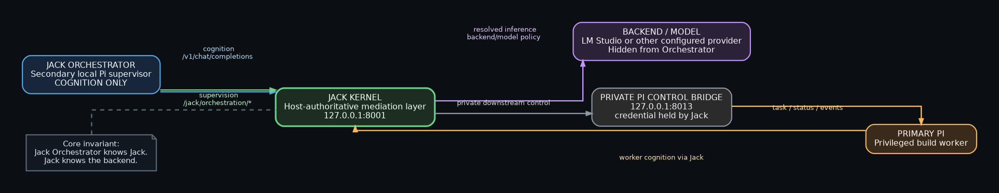
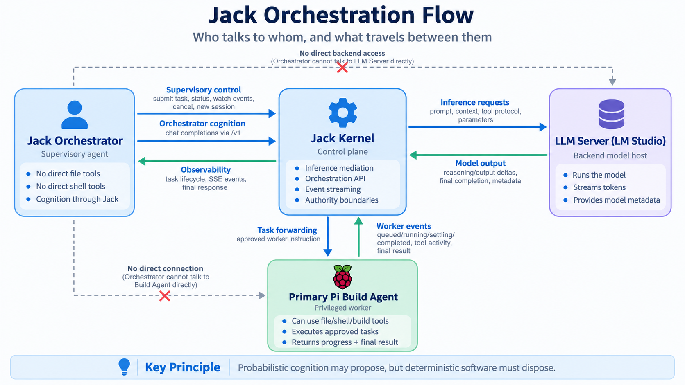

# Jack Kernel — The Harness for the Harness

**v0.1.1**

**Probabilistic cognition may propose, but deterministic software must dispose.**

Jack Kernel is a **local-first, host-authoritative inference mediation and control runtime** that sits between an application or agent and an OpenAI-compatible model backend.

Jack is **not the agent and not the LLM**. The agent chooses the task and workflow. The model supplies probabilistic cognition. Jack owns deterministic boundaries around that cognition: stage topology, reasoning and sampling controls, tool exposure, context projection, answer/commit authority, retention, evidence handling, runtime identity, consequence disposition, and selected security controls.

Deep Research, Agentic, and Code Debugging are **reference programs built on the kernel**. They demonstrate what Jack can express; they are not the product boundary.

> **Start here:** [`00_Jack_Kernel_Plain_English_Master_Guide_v0.1.1.docx`](00_Jack_Kernel_Plain_English_Master_Guide_v0.1.1.docx)
>
> **Install and run:** [`GETTING_STARTED.md`](GETTING_STARTED.md)
>
> **Current security state:** [`CURRENT_SECURITY_STATUS.md`](CURRENT_SECURITY_STATUS.md)

## Architecture at a glance

```text
Application / Agent / Supervisor
            |
            v
       Jack Kernel
            |
            v
OpenAI-compatible model backend
```

With Orchestration Gateway v2 enabled, Jack also mediates the supervisor-to-worker control boundary:

```text
Supervisor
   |
   v
Jack Kernel :8001/jack/orchestration
   |
   v
private authenticated worker bridge
   |
   v
Primary Pi / privileged worker
   |
   v
Jack Kernel :8001/v1
   |
   v
configured local backend
```

A cloud-model supervisor retains its native cloud cognition and uses Jack for worker control. A local-model supervisor uses Jack for both local cognition and worker control.

The accepted all-local architecture is illustrated here:





## What Jack owns

Jack's host-authoritative boundary includes, where applicable:

- caller request reconstruction and hidden-authority stripping;
- virtual caller-facing model identity versus actual backend identity;
- mode and stage topology;
- stage-specific reasoning and sampling controls;
- tool visibility and tool-call validation;
- context preparation and long-horizon state projection;
- answer/commit authority;
- evidence namespace protection;
- runtime and lane identity surfaces;
- supervisor-to-worker orchestration mediation;
- deterministic security outcomes and consequence disposition;
- represented-path policy;
- the runtime-scoped Authority & Security Ledger;
- deterministic authority over the closed Phase-7 known-credential set at validated model ingress, model egress, orchestration observer release, diagnostic release, and exact credential-resource boundaries.

Jack does not acquire authority merely because it can observe a value. Observability is not authority, evidence is not authority, a port is not identity, cancellation is not settlement, and represented targets are not necessarily resolved host objects.

## What Jack does not claim

Jack is not a universal operating-system sandbox, filesystem-object attestation layer, shell-effects oracle, distributed consensus ledger, or proof that every represented consequence was physically realized by an external executor.

Phase 7 also does not claim hostile in-process tamper resistance, universal third-party logger control, encrypted-at-rest credential custody redesign, or the Phase 8–11 integrity/privacy mechanisms.

See [`CURRENT_SECURITY_STATUS.md`](CURRENT_SECURITY_STATUS.md) for the exact current claims and nonclaims.

## Current validated state

The current frozen security checkpoint is **Phase 7 — Credential Isolation and Integrated DLP**.

Validated annotated tag:

`security-layer-phase7-validated-2026-10-05`

Tag object:

`ffde3865178ac14c44d6222a39e0e59e6d8518a9`

Validated closure target:

`59aef730e11031b23f67c735e35f1e68c9ecc394`

The cumulative validated security stack is:

- **Phases 0–3:** deterministic `SecurityOutcome`, StreamingIRQ bounded pre-release quarantine, malformed-SSE release protection, exact-match Canary enforcement, immutable runtime/lane-bound static Tier A/B Canary policy.
- **Phase 4:** Restricted Paths, optional Workspace Lock, represented-path normalization, bounded recognized command authorization, executor admission, and minimum multi-call containment.
- **Phase 5:** deterministic Consequence Gate that consumes typed authoritative facts and selects the narrowest justified disposition without centralizing failure blast radius.
- **Phase 6:** process-local Authority & Security Ledger with closed event schemas, canonical predecessor chaining, immutable committed projection, bounded fail-soft durability, restart isolation, and narrow ledger-authority freeze semantics.
- **Phase 7:** closed known-credential authority, exact model-input isolation, credential-derived model-output DLP through the existing StreamingIRQ barrier, orchestration and diagnostic release DLP, exact credential-resource `DENY_AND_CONTINUE`, and safe Phase-7 event observation in the existing ledger chain.

Phases 8–11 have not started.

For exact validation evidence and phase-by-phase nonclaims, use [`CURRENT_SECURITY_STATUS.md`](CURRENT_SECURITY_STATUS.md) and the detailed checkpoint records under [`docs/security/`](docs/security/).

## Run on Windows

The current validated development/release baseline is **Python 3.14.6**. Repository validation additionally uses **Node.js 24.16.0** for the Pi bridge harnesses.

Install runtime dependencies:

```powershell
py -3 -m pip install -r requirements.txt
```

Start Jack:

```powershell
.\start.bat
```

Default agent-facing endpoint:

```text
http://127.0.0.1:8001/v1
```

LM Studio is the default backend at `http://127.0.0.1:1234/v1`. Jack also supports Ollama, Jan.ai, raw llama.cpp `llama-server`, and custom OpenAI-compatible endpoints.

Port `8001` is Jack's default agent-facing listener. Port `8000` remains available for the common custom OpenAI-compatible/vLLM backend topology:

```text
agent -> Jack :8001 -> backend :8000
```
